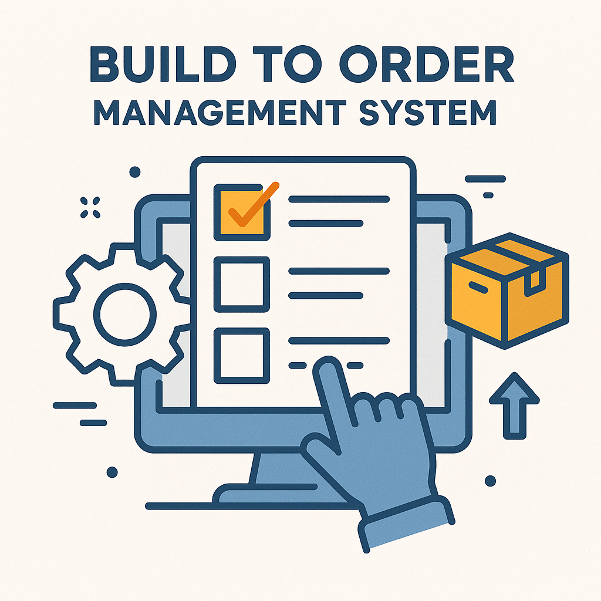

<br/>
<div align="center">
<a href="https://github.com/ShaanCoding/ReadME-Generator">

</a>
<h3 align="center">BTO Management System</h3>
<p align="center">

<br/>
<br/>
<a href="https://zenkang.github.io/BTOproject/"><strong>Explore the docs »</strong></a>

  


</p>
</div>

[]
## About The Project

NTU AY2024/25 Semester 2 SC2002 Group Project - BTO Management System (BTOMS).

Build-To-Order Management System (BTOMS) is a Java command line interface (CLI) application that utilizes object-oriented concepts to efficiently manage BTO projects. The program is designed with a focus on reusability, extensibility, and maintainability, allowing for easy upgrades and future development. It provides flexibility to accommodate different user types and their requirements.

The initial password for every user is password.
### Prerequisites

Java 23


## Highlights
Controllers manage interaction logic, Repositories persist data to CSV, and Boundaries manage the CLI

Use of enumerations for ApplicationStatus, RegistrationStatus, Role etc, to enforce valid values

SHA-3 Password Encryption**: User passwords are encrypted using the SHA-256 algorithm for enhanced
security.
## Features

- [x] Applicant
  - [x] View my profile
  - [x] Change my password
  - [x] View projects
  - [x] Apply project
  - [x] View project application status
  - [x] Withdraw application
  - [x] Submit Enquiry
  - [x] Edit Enquiry
  - [x] Delete Enquiry

- [x] Officer
  - [x] View my profile
  - [x] Change my password
  - [x] View project
  - [x] Apply project
  - [x] View project application status
  - [x] Withdraw application
  - [x] Submit Enquiry
  - [x] Edit Enquiry
  - [x] Delete Enquiry
  - [x] Register for project
  - [x] Reply to Enquiry for handled project
  - [x] Book flat application
  - [x] Generate receipt for booked flat

- [x] Manager
  - [x] View My Profile
  - [x] Change My Password
  - [x] Create project
  - [x] Update project details
  - [x] Delete project
  - [x] View project registration for own project
  - [x] View project application for own project
  - [x] Approve project registration
  - [x] Approve project application
  - [x] View enquiries for own project
  - [x] Reply to enquiry
  - [x] Generate Report
 

### Installation


1. Clone the repo
   ```sh
   git clone https://github.com/zenkang/BTOproject.git
   ```
2. Use JetBrains IntelliJ IDEA to build the project
3. Run Main.java in the BTOproject/src

## License

Distributed under the MIT License. See [MIT License](https://opensource.org/licenses/MIT) for more information.
## Acknowledgments

Contributors of this project


- [Zen](https://github.com/zenkang)
- [Jarrel ](https://github.com/Jarrel-web)
- [Hweej ](https://github.com/dingerbonger)
- [Jun Rong](https://github.com/JunRongLJR)
- [Rohita](https://github.com/Rohita-Kattta)
